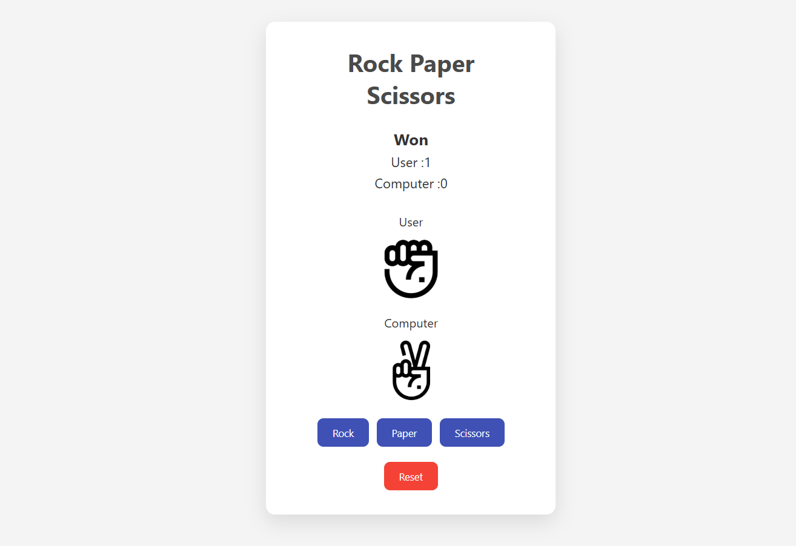

# 🪨 Rock Paper Scissors Game

A simple and interactive **Rock Paper Scissors** game built with **React**. It allows the user to play against the computer, keeps track of scores, and features animated images for each choice.

---

## 🚀 Features

- 🎮 Playable game logic with real-time result display
- 🖼️ Visual feedback using images (rock, paper, scissors)
- ✨ Animations when selecting choices
- 📊 Score tracking for both user and computer
- 🔁 Reset button to restart the game

---

## 📸 Preview



---

## 🛠️ Tech Stack

- React
- JavaScript
- CSS (custom styling + animations)

---

## 📂 Project Structure

src/
├── assets/ # rock.png, paper.png, scissors.png
├── App.jsx # Main React component
├── index.css # Styling and animations
└── main.jsx # App entry point (Vite or CRA)


---

## 📦 Installation

1. Clone the repository:

```bash
git clone https://github.com/EimaneLassakeur/rock-paper-scissors.git
cd rock-paper-scissors
```

2. Install dependencies:

```bash
npm install
```

3.Run the app:

```bash
npm run dev  
```